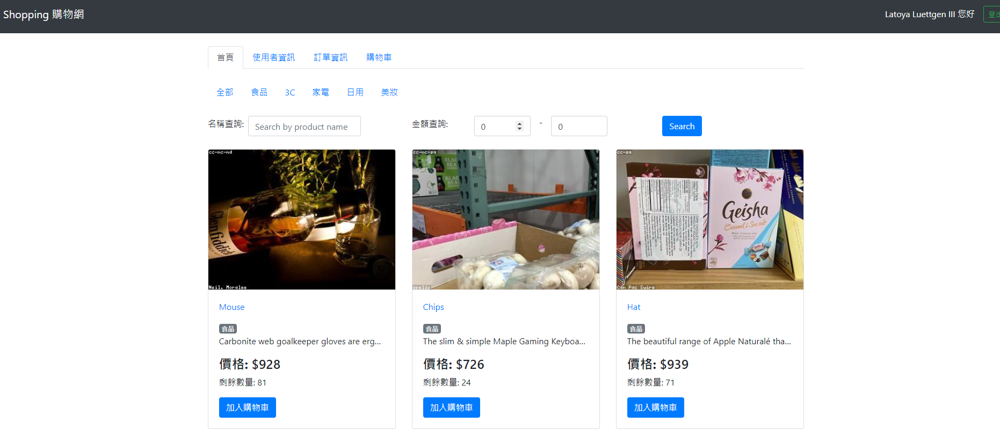

# 購物網站



## 介紹

這是一個使用 Vue3 + Node.js + MySQL 打造的購物網站，佈署在 heroku 上方
https://ian920511.github.io/shopping-front-end/

---

## 功能

- 使用者需註冊會員並登入才能購物網站
- 可以觀看全部商品
- 可以使用分類、關鍵字、金額範圍來查看及搜尋商品
- 賣家可以新增、刪除、修改商品資訊
- 買家可以新增、刪除、修改購物車內容
- 使用者可以在訂單資訊觀看購買或賣出資訊

---

## 開始使用

1.先確認有安裝 node.js 與 npm

2.開啟終端機(Terminal)，clone 此專案

```bash
git clone https://github.com/Ian920511/shopping-back-end.git
```

3.初始化

```bash
cd shopping-back-end //進入存放檔案的資料夾
npm install  //安裝插件
```

4.新增 .env 檔，設定環境變數連線，並根據 .env.example 檔案內資訊設置環境變數


5.安裝完成後，需新增種子資料，輸入下方程式碼:
(種子帳號為: user1，密碼為: 12345678)

```bash
npm run seed
```

6.完成後，輸入

```bash
npm run dev
```

7.看見此行訊息則代表順利運行

```bash
Sever is running on http://localhost:3000
```

8.可以使用以下帳號密碼進行登入測試

```bash
賣家:
account: seller001
password: titaner

買家:
account: buyer001
password: titaner
```

9.若需要暫停伺服器，則輸入

```bash
ctrl + c
```

---

## 規格

- 程式編輯器: [Visual Studio Code](https://visualstudio.microsoft.com/zh-hant/ "Visual Studio Code")
- 使用框架: [express](https://www.npmjs.com/package/express)@4.18.2
- 資料庫: [MySQL]
- 使用者認證: [passport](https://www.npmjs.com/package/passport)@0.6.0
- 使用者認證: [passport-local](https://www.npmjs.com/package/passport-local)@1.0.0
- 使用者認證: [passport-jwt](https://www.npmjs.com/package/passport-jwt)@4.0.1
- 其他工具及版本請詳見 package.json
